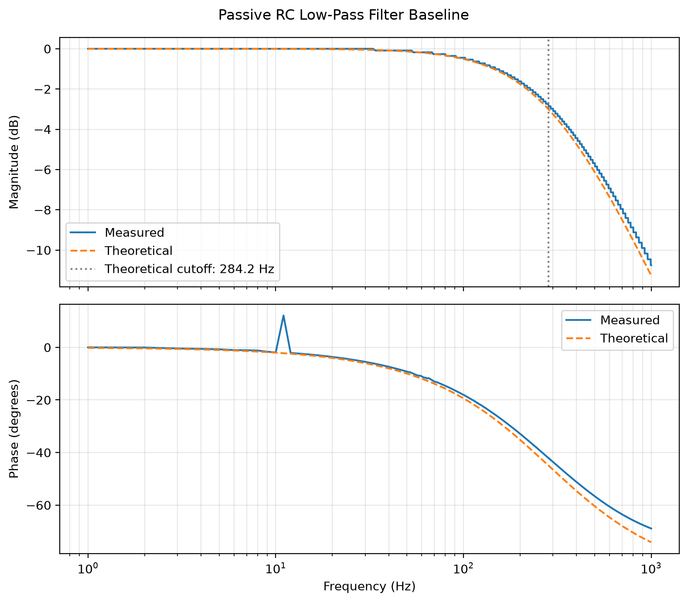

# LabVIEW Bode Frequency Response Analyzer

A LabVIEW and NI-DAQmx application for measuring the magnitude and phase response of analog electronic filters using an NI USB-6212 data-acquisition device.

## Current Status

The current baseline performs frequency-response measurements for a passive low-pass filter using generated excitation, synchronized acquisition, loopback calibration, and tone measurements.

Active-filter support is under development and has not yet been validated.

## Passive RC Baseline

A 56 kΩ resistor and 10 nF capacitor give a theoretical cutoff frequency of 284.21 Hz. The baseline measurement produced:

- Measured -3 dB cutoff: 300.29 Hz
- Difference from nominal prediction: 5.7%
- Magnitude RMSE: 0.401 dB
- Phase RMSE: 3.739 degrees

The baseline agrees well with the theoretical first-order response. An isolated phase outlier at 11 Hz is retained in the published data. It is consistent with the fixed 0.2-second acquisition window containing too few cycles at low frequencies and motivates the next acquisition improvement.

## Project Goals

- Measure filter input and output signals using synchronized acquisition
- Generate Bode magnitude and phase plots
- Support passive and active filter circuits
- Use logarithmically spaced test frequencies
- Account for settling time and acquisition quality
- Compare experimental measurements with theoretical predictions
- Detect clipping, weak signals, and invalid measurements
- Export sanitized example data for reproducible analysis

## Hardware

- NI USB-6212 multifunction DAQ
- Passive RC filter components
- Active op-amp filter components
- External op-amp power supply when required

## Software

- LabVIEW 2026
- NI-DAQmx
- NI Measurement & Automation Explorer

## Repository Structure

- `src/`: LabVIEW source files
- `analysis/`: Data-analysis and validation scripts
- `data/examples/`: Sanitized example measurements
- `docs/`: Public diagrams and documentation
- `tests/`: Validation procedures and expected results

## Development Roadmap

1. Preserve and validate the existing passive-filter implementation
2. Record a passive-filter baseline
3. Improve frequency selection and settling behavior
4. Add simultaneous input/output acquisition
5. Validate active-filter measurements
6. Add theoretical-response comparison and quality checks
7. Document the final experimental system

## Privacy

This public repository excludes credentials, institutional paths, device serial numbers, private documentation, and unsanitized experimental data.

## USB-6212 phase correction

The analyzer compensates for the one-sample relative channel offset observed
in the USB-6212 acquisition path. See
[NI USB-6212 Phase Correction](docs/usb-6212-phase-correction.md) for the
equation, validation procedure, and limitations.
